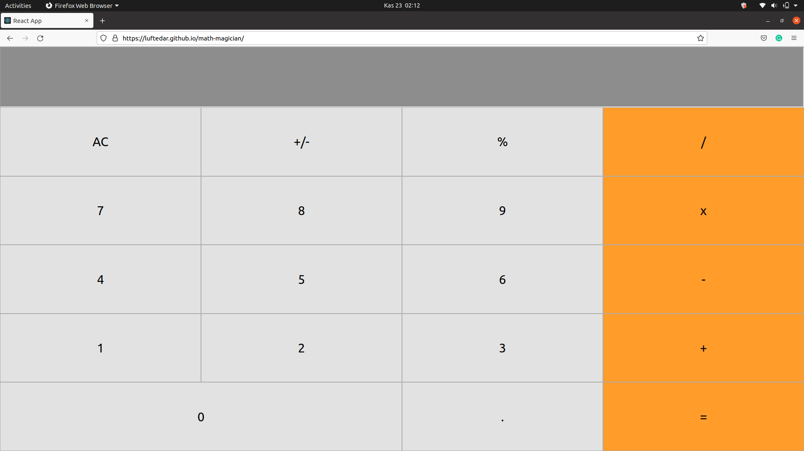

# Math Magicians

> This project was bootstrapped with [Create React App](https://github.com/facebook/create-react-app)



## Built With

- React JS

## Live Demo

[Live Demo Link](https://luftedar.github.io/math-magician/)


## Getting Started

To get a local copy up and running follow these simple example steps.

```
git clone https://github.com/luftedar/math-magician.git
```

cd into the folder

```
cd math-magician
```

To run on local server

```
npm install react-scripts
npm start
```

> The page will reload automatically if you make any edits.

> You will also see any lint errors in the console if there is.

## Authors

👤 **Orçun Uğur**

- GitHub: [@githubhandle](https://github.com/luftedar)
- Twitter: [@twitterhandle](https://twitter.com/OrcunUgur2)
- LinkedIn: [LinkedIn](https://www.linkedin.com/in/or%C3%A7un-u%C4%9Fur-089148181/)


## 🤝 Contributing

Contributions, issues, and feature requests are welcome!

Feel free to check the [issues page](../../issues/).

## Show your support

Give a ⭐️ if you like this project!

## Acknowledgments

- This project built in Microverse's second module's first week.

## 📝 License

This project is [MIT](./MIT.md) licensed.
